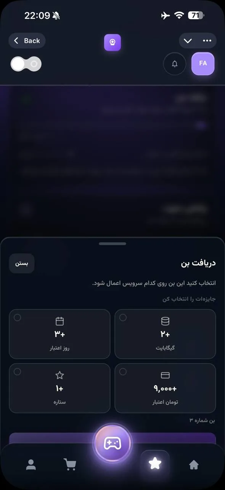
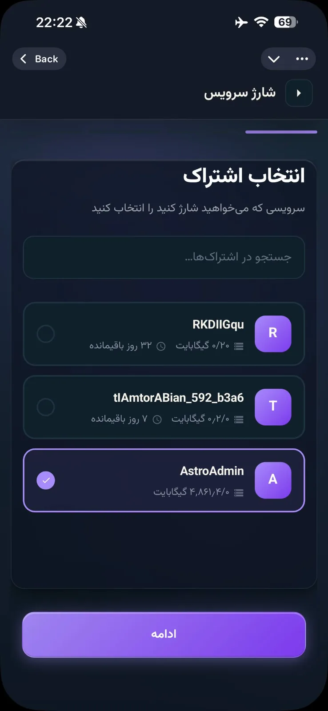
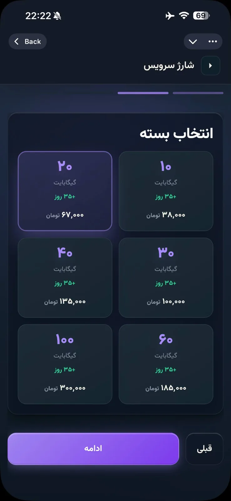
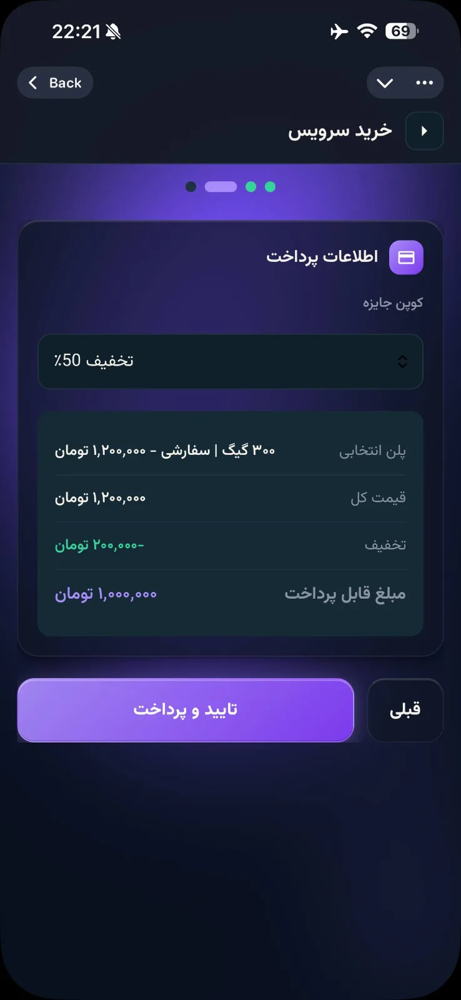
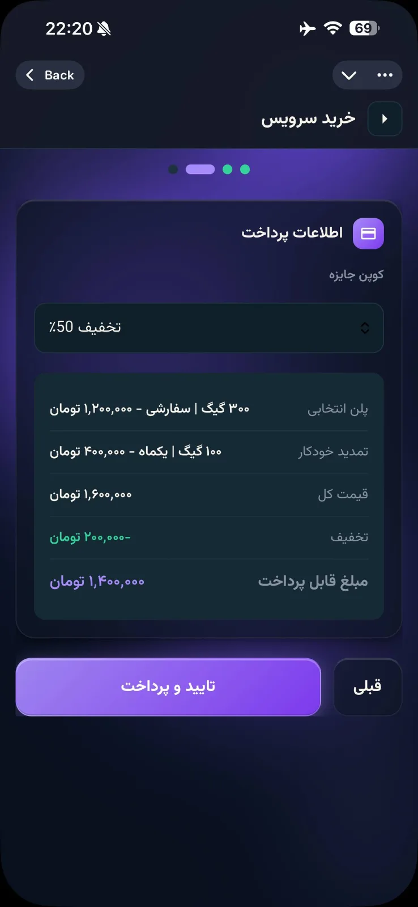
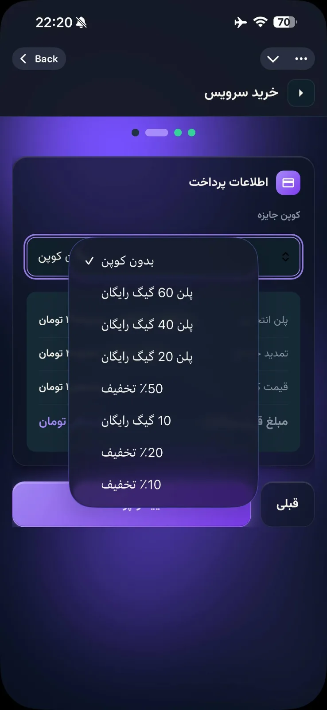

# astro-user

- [ ] on ios dont show orbit yet cuz we dont have app for that.
- [ ] when i click on the apps it shows a popup saying open link and when i click open it does open the right app but if i dont and take a bit of time another popup opens behind that popup saying it looks like the app doesnt exist on ur phone... so can u fix it to auto detect it or find a new approach for it
- [ ] for app guide, put karing as our ios recommendation and orbit for android
- [ ] speed test, shows 40 mb but in ookla it shows 5MB/S can we do anything aboutit to show a real one like ookla?
- [ ] make the whole apps popups to just look better and match theme and accesnt colors
- [ ] the claim menu is still hidden behind navbar and cant use it properly and its not just this other one too for bon 
- [ ] ok so now keyboard on iphone is way better and still, but no way to close it now
- [ ] its letting me charge and select a unlimited account 
- [ ] make the charge plans same as purchase new plans and add custom plans too 
- [ ] the coupon discount coupons arent working right 
- [ ] make a prettier and more clear explained drop down for coupons 
- [ ] remove the recent actions from user profile
- [ ] import from clipboard still not working at all
