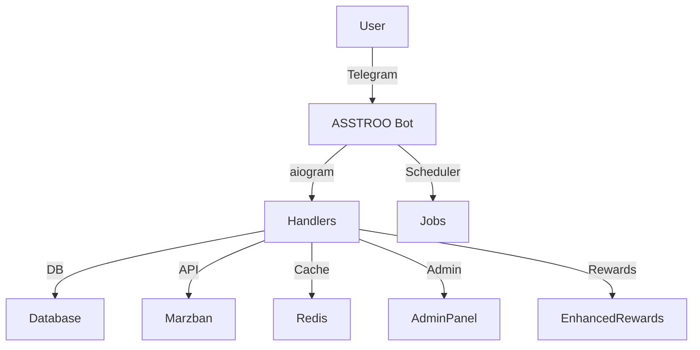
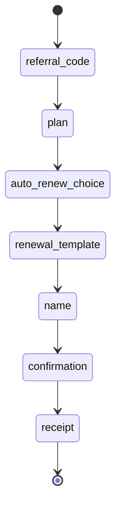

# ASSTROO Project Overview

---

## 1. Project Overview

**ASSTROO** is a comprehensive Telegram bot platform for managing digital subscription services (e.g., VPN/proxy), with advanced user management, admin controls, automated billing, analytics, and a gamified rewards system. It integrates with the Marzban panel for service provisioning and supports both end-users and administrators with rich, interactive flows.

### Key Use Cases
- Automated subscription sales and management for digital services (VPN, proxy, etc.)
- Gamified user engagement (rewards, achievements, leaderboards)
- Admin dashboard for business operations, analytics, and support
- Seamless integration with Marzban for provisioning and monitoring

---

## 2. High-Level Architecture

- **Bot Framework:** [aiogram](https://docs.aiogram.dev/) (async Python Telegram bot framework)
- **Database:** SQLAlchemy ORM (async, SQLite by default)
- **Cache:** Redis (optional, for performance)
- **Scheduler:** APScheduler (for background jobs)
- **External Integration:** Marzban API (for VPN/proxy service management)
- **Modular Handlers:** User, admin, and system flows are separated into handler modules
- **Enhanced Rewards:** Gamification, achievements, loyalty, and analytics

### Component Diagram


### Technologies Used
- **Python 3.10+**
- **aiogram** for async Telegram bot
- **SQLAlchemy** for ORM/database
- **APScheduler** for background jobs
- **Redis** for caching (optional)
- **aiohttp** for async HTTP (Marzban API)
- **Structured logging** (custom logger)

---

## 3. Directory Structure & Module Deep Dive

```
app/
├── main.py                # Entry point, bot setup, scheduler, middleware
├── core/                  # Core configs, settings, and static data
├── database/              # ORM models, CRUD, and DB utilities
├── handlers/              # All user/admin bot flows (modular)
│   └── rewards/           # Enhanced rewards system (submodules)
├── jobs/                  # Background/periodic jobs
├── keyboards/             # Reply and inline keyboard layouts
├── services/              # Integrations (e.g., Marzban API)
├── utils/                 # Utilities: logging, validation, middleware
├── user_state.json        # Persistent user state (FSM)
├── allowed_users.json     # User allowlist (legacy/compat)
```

### main.py
- **Purpose:** Entry point. Sets up the bot, registers routers, configures middleware, and starts the scheduler.
- **Key Classes/Functions:**
  - `main()`: Async entry, initializes DB, Redis, bot, dispatcher, jobs, notification worker.
  - `DbSessionMiddleware`: Injects DB session into handler context.
  - `notification_worker`: Async queue for sending notifications to users.
- **Example:**
```python
async def main():
    setup_logging()
    await init_db()
    bot = Bot(token=BOT_TOKEN)
    dp = Dispatcher(storage=PersistentStorage(...))
    dp.include_router(start.router)
    ...
    scheduler = AsyncIOScheduler()
    scheduler.add_job(...)
    await dp.start_polling(bot)
```

### core/
- **`settings/` package:** All main settings (token, admin, Marzban, plans, packages, job schedules). Split across modules under `app/core/settings/`; JSON overrides still live in `app/core/`. Import via `from app.core.settings import …`.
- **redis_config.py:** Redis connection/init logic.
- **validation_config.py, error_config.py, level_config.py:** Validation, error, and level-up logic.
- **plans.json, charge_packages.json:** Editable via admin panel.
- **inbounds.json:** Marzban inbound config.

### database/
- **models.py:** All ORM models (User, Subscription, Referral, etc.).
- **crud.py:** Async CRUD operations for all models. Business logic for user, subscription, rewards, etc.
- **cached_crud.py:** Cached versions of CRUD for performance.
- **indexes.py:** DB index management.
- **bot.db:** SQLite DB file (default).

### handlers/
- **start.py:** `/start` command, onboarding, referral FSM.
- **purchase.py:** Subscription purchase FSM (multi-step, plan, referral, payment, confirmation).
- **my_services.py:** User's service management (view, usage, renewal, etc.).
- **charge.py:** Top-up FSM (traffic, days, >5GB logic).
- **add_subscription.py:** Add/link existing Marzban subscription.
- **referral.py:** Referral code, invitees, rewards.
- **tutorials.py:** Device setup guides.
- **admin_*.py:** Admin flows (dashboard, users, services, financials, settings, etc.).
- **common.py:** Shared handler logic (e.g., back to main menu).
- **rewards/:** Enhanced rewards system (see below).

#### handlers/rewards/
- **menu.py:** Main rewards menu, wallet, profile, navigation.
- **achievements.py:** Achievements earned, progress, display.
- **gifts.py:** Peer-to-peer gift FSM.
- **redemption.py:** Voucher redemption logic.
- **leaderboard.py:** Rankings by referrals, usage, etc.
- **profile.py:** User profile, XP, streaks, analytics.
- **wallet.py:** Wallet management (credit, loyalty points).
- **history.py:** Reward history log.

### jobs/
- **renewal.py:** Subscription renewal logic, rollover, Marzban patching.
- **notifications.py:** Low data, expiry, and expired notifications.
- **carryover.py:** Cleanup of old carry-over traffic.
- **enhanced_rewards.py:** Analytics update, reward jobs.

### keyboards/
- **reply.py:** Reply keyboard layouts (main, purchase, admin, etc.).
- **inline.py:** Inline keyboard layouts (renewal, actions).

### services/
- **marzban.py:** Marzban API integration (user creation, info, traffic, expiry, status, etc.).

### utils/
- **logger.py:** Structured logging, error handling, decorators.
- **error_middleware.py:** Error, rate limit, validation, performance middleware.
- **banned_user_middleware.py:** Banned user checks.
- **persistent_storage.py:** FSM state persistence.
- **validation.py, persian_utils.py:** Input validation, Persian number parsing.

---

## 4. Core Features (with Examples)

### User Flows

#### 1. Start & Onboarding
- **/start** command triggers onboarding.
- Checks allowed users, creates user if new, asks for referral code if needed.
- **Example:**
  - User: `/start`
  - Bot: "Welcome! Please enter your referral code or tap 'Skip'."

#### 2. Purchase Subscription (FSM)
- Multi-step: referral code → plan selection → auto-renew → name → confirmation → receipt.
- **FSM Diagram:**

- **Example:**
  - User: "Buy Subscription"
  - Bot: "Enter referral code or skip."
  - User: "SKIP"
  - Bot: "Choose a plan: 20GB, 40GB, ..."
  - ...

#### 3. Manage Services
- View all subscriptions, usage, expiry, renewal, add new, etc.
- **Example:**
  - User: "My Services"
  - Bot: "You have 2 active subscriptions: [user1], [user2]"

#### 4. Charge/Top-up
- Buy extra traffic/days, with logic for >5GB rollover.
- **Example:**
  - User: "Charge Service"
  - Bot: "Select subscription."
  - Bot: "You have 7GB left. Continue with 5GB rollover or reserve plan?"

#### 5. Add Existing Subscription
- Paste Marzban subscription link, bot parses and links.
- **Example:**
  - User: "Add Subscription"
  - Bot: "Paste your subscription link."

#### 6. Referral System
- Show referral code, invitees, rewards.
- **Example:**
  - User: "Referral Code"
  - Bot: "Your code: ABC123. Invite friends for rewards!"

#### 7. Tutorials
- Device-specific setup guides, forwards messages from tutorial channel.
- **Example:**
  - User: "Tutorials"
  - Bot: "Choose your device: Android, iOS, Windows."

#### 8. Enhanced Rewards
- Wallet, loyalty points, achievements, daily/weekly challenges, send/receive gifts.
- **Example:**
  - User: "Rewards"
  - Bot: "Wallet: 10,000 Toman, 3 stars, 50 loyalty points."

### Admin Flows

#### 1. Dashboard
- Key stats, quick actions, system health.
- **Example:**
  - Admin: "Dashboard"
  - Bot: "Users: 1,000, Active Subs: 500, Revenue: 10M Toman, Marzban: Online"

#### 2. User Management
- Search, edit, ban/unban, chat relay, credit management.
- **Example:**
  - Admin: "Users"
  - Bot: "Search, list, ban, edit users."

#### 3. Service Management
- Approve/deny, sync, bulk actions, Marzban status.
- **Example:**
  - Admin: "Services"
  - Bot: "List: Active, Pending, Expired. Sync Marzban."

#### 4. Financials
- Revenue, wallet, charge requests, reports.
- **Example:**
  - Admin: "Financials"
  - Bot: "Total Revenue: 10M, Pending: 1M, Wallets: 2M."

#### 5. Broadcast
- Send messages to all/targeted users.
- **Example:**
  - Admin: "Broadcast"
  - Bot: "Send to: All, Active, VIP, New, Inactive."

#### 6. Settings
- Manage plans, charge packages, job schedules.
- **Example:**
  - Admin: "Settings"
  - Bot: "Plans: 20GB, 40GB. Add/Edit/Delete."

#### 7. System
- Logs, backup, health, DB index management, cache control.
- **Example:**
  - Admin: "System"
  - Bot: "CPU: 20%, RAM: 50%, DB: 100MB, Uptime: 2d."

#### 8. Reward Settings
- Adjust reward percentages.
- **Example:**
  - Admin: "/rewards"
  - Bot: "Traffic: 5%, Days: 1%, Credit: 10%."

---

## 5. Database Schema (Key Models, Diagrams, and Fields)

### Entity-Relationship Diagram
```mermaid
erDiagram
    USER ||--o{ SUBSCRIPTION : has
    USER ||--o{ REFERRAL : made
    USER ||--o{ USERACHIEVEMENT : earned
    USER ||--o{ USERCHALLENGE : participates
    USER ||--o{ REWARDHISTORY : receives
    USER ||--o{ USERANALYTICS : logs
    USER ||--o{ USERGIFT : sends/receives
    SUBSCRIPTION ||--o{ RECEIPT : has
    SUBSCRIPTION ||--o{ REFERRALREWARD : triggers
    SUBSCRIPTION ||--o{ CHARGEREQUEST : topup
    CHALLENGE ||--o{ USERCHALLENGE : tracks
    ACHIEVEMENT ||--o{ USERACHIEVEMENT : tracks
```

### User
| Field              | Type        | Description                       |
|--------------------|------------|-----------------------------------|
| id                 | Integer    | PK                                |
| chat_id            | BigInteger | Telegram user ID                  |
| username           | String     | Telegram username                 |
| full_name          | String     | User's full name                  |
| referral_code      | String     | Unique invite code                |
| phone_number       | String     | Optional                          |
| created_at         | DateTime   | Join date                         |
| stars              | Integer    | Gamification                      |
| credit             | Integer    | Wallet balance (Toman)            |
| banned             | Boolean    | Banned status                     |
| level, xp, streaks | Integer    | Gamification, loyalty             |
| loyalty_points     | Integer    | Loyalty system                    |
| ...                | ...        | See models.py for all fields      |

### Subscription
| Field                | Type        | Description                       |
|----------------------|------------|-----------------------------------|
| id                   | Integer    | PK                                |
| user_id              | Integer    | FK to User                        |
| marzban_username     | String     | Marzban panel username            |
| plan_name            | String     | Plan (20GB, 40GB, etc.)           |
| price                | Integer    | Price (Toman)                     |
| status               | String     | pending, active, expired, etc.    |
| ...                  | ...        | Renewal, carry-over, etc.         |

### Other Models
- **Receipt:** Payment tracking
- **Referral/ReferralReward:** Invite and reward logic
- **ChargeRequest:** Pending top-ups
- **Achievement/UserAchievement:** Gamification
- **Challenge/UserChallenge:** Daily/weekly/seasonal
- **RewardHistory:** All rewards
- **UserAnalytics:** Daily activity
- **Leaderboard:** Rankings
- **UserGift:** Peer-to-peer gifts

---

## 6. Handlers and Bot Logic (with Code Examples)

### FSM Example: Purchase Flow
```python
class PurchaseState(StatesGroup):
    referral_code = State()
    plan = State()
    auto_renew_choice = State()
    renewal_template = State()
    name = State()
    confirmation = State()
    receipt = State()
    edit_choice = State()

@router.message(F.text == 'Buy Subscription')
async def start_purchase(message: Message, state: FSMContext, session: AsyncSession):
    await state.set_state(PurchaseState.referral_code)
    await message.answer('Enter referral code or skip.')
```

### Middleware Example
```python
dp.update.outer_middleware.register(DbSessionMiddleware(session_pool=AsyncSessionLocal))
dp.update.outer_middleware.register(ErrorHandlingMiddleware())
dp.update.outer_middleware.register(RateLimitMiddleware())
dp.update.outer_middleware.register(ValidationMiddleware())
dp.update.outer_middleware.register(PerformanceMiddleware())
dp.update.outer_middleware.register(BannedUserMiddleware())
```

### Error Handling Example
```python
def log_error(error: Exception, context: Optional[Dict[str, Any]] = None, user_id: Optional[int] = None):
    error_context = {
        "error_type": type(error).__name__,
        "error_message": str(error),
        ...
    }
    bot_logger.error(f"Error: {error}", **(context or {}))
```

---

## 7. Enhanced Rewards System (Deep Dive)

### Features
- **Wallet:** Credit, loyalty points, vouchers
- **Achievements:** Earned for referrals, purchases, logins, usage, etc.
- **Challenges:** Daily/weekly/seasonal, with progress bars and rewards
- **Leaderboard:** Rankings for referrals, usage, activity, spending
- **Gifts:** Send/receive credit or loyalty points to/from other users
- **Reward History:** Full log of all rewards
- **Profile:** Level, XP, streaks, analytics

### Example: Sending a Gift
```python
@router.callback_query(F.data == "enhanced_send_gift")
async def start_gift_process(callback: CallbackQuery, state: FSMContext):
    await callback.message.edit_text("Enter receiver chat_id:")
    await state.set_state(GiftStates.waiting_for_receiver)
```

### Achievements Example
```python
@router.callback_query(F.data == "enhanced_achievements")
async def show_achievements(callback: CallbackQuery, session: AsyncSession):
    user = await get_user(session, callback.from_user.id)
    achievements = await get_user_achievements(session, user.id)
    ...
```

---

## 8. Background Jobs (Logic & Scheduling)

### Job Types
- **Renewal Job:** Auto-renews subscriptions based on thresholds, handles rollover
- **Notification Job:** Alerts users for low data, imminent expiry, expired services
- **Carryover Cleanup:** Cleans up old carry-over traffic
- **Analytics Update:** Periodically updates user analytics

### Example: Adding a Job
```python
scheduler = AsyncIOScheduler(timezone="UTC")
scheduler.add_job(renewal_job, 'interval', minutes=5, args=[bot])
scheduler.add_job(check_low_data_job, 'interval', hours=4, args=[bot])
```

### Job Scheduling (`app/core/settings/support_system.py`)
```python
JOB_SCHEDULES = {
    "update_user_analytics_job": {"type": "interval", "hours": 6},
    "check_low_data_job": {"type": "interval", "hours": 4},
    ...
}
```

---

## 9. Configuration (with Examples)

### Configuration package (`app/core/settings/`)

Typical imports: `from app.core.settings import BOT_TOKEN, PLANS, JOB_SCHEDULES, …`. See `support_system.py` for `JOB_SCHEDULES`, `catalog_plans.py` for `PLANS` / charge presets, `web_game.py` for arcade URLs and `GAME_REWARDS`, `security.py` for admin/password helpers.

### plans.json
```json
{
  "20GB": {"price": 50000, "gb": 20},
  "40GB": {"price": 80000, "gb": 40}
}
```

### charge_packages.json
```json
{
  "10 GB": {"gb": 10, "price": 50000},
  "30 Days": {"days": 30, "price": 60000}
}
```

---

## 10. Extensibility (How to Add Features)

### Add a New Handler
```python
# my_feature.py
from aiogram import Router
router = Router()
@router.message(F.text == 'My Feature')
async def my_feature_handler(message: Message):
    await message.answer('Hello from my feature!')
# In main.py:
dp.include_router(my_feature.router)
```

### Add a New DB Model
```python
class MyModel(Base):
    __tablename__ = 'my_model'
    id = Column(Integer, primary_key=True)
    ...
# Add to models.py, create CRUD, and migrate DB
```

### Add a New Job
```python
def my_job(bot):
    ...
scheduler.add_job(my_job, 'interval', minutes=10, args=[bot])
```

---

## 11. Security, Error Handling, and Edge Cases

### Security
- **Admin Checks:** All admin flows require admin ID(s)
- **Input Validation:** All user input is validated and sanitized
- **Sensitive Data:** Keep tokens/passwords out of version control
- **Database Integrity:** Use transactions and constraints

### Error Handling
- **Centralized Logging:** All errors are logged with context
- **Graceful Fallback:** User-friendly error messages
- **Rate Limiting & Anti-Spam:** Middleware to prevent abuse

### Edge Cases
- **User tries to buy same subscription twice:** Handled in add_subscription.py
- **Referral code self-use:** Prevented in purchase.py
- **Marzban API errors:** All calls wrapped with retry and error handling

---

## 12. Appendix

### File Formats
- **allowed_users.json:** List/dict of allowed users (legacy, supports migration)
- **user_state.json:** FSM state persistence
- **plans.json, charge_packages.json:** Editable plans/packages

### Marzban API Usage (Deep Dive)
- **User creation:** `add_user(username, data_limit_gb, expire_days)`
- **Get user info:** `get_user_info(username)`
- **Get subscription URL:** `get_subscription_url(username)`
- **Delete user:** `delete_user(username)`
- **Reset traffic:** `reset_user_traffic(username, new_data_limit_gb, new_expire_days)`
- **Toggle status:** `toggle_user_status(username, status)`
- **All API calls use aiohttp, handle token refresh, and log errors.**

### Example: Adding a New Plan
1. Use the admin panel (`تنظیمات⚙️` > `مدیریت پلن‌ها`)
2. Or edit `plans.json` directly
3. Changes are picked up automatically

---

## 13. Glossary
- **FSM:** Finite State Machine (multi-step user flows)
- **CRUD:** Create, Read, Update, Delete (DB operations)
- **Marzban:** External panel for VPN/proxy management
- **Voucher:** Redeemable reward for users
- **Toman:** Currency unit (Iran)
- **Admin Panel:** Telegram-based admin interface
- **Achievement:** Gamified milestone for users
- **Challenge:** Time-limited task for rewards
- **Leaderboard:** Ranking of users by metric
- **Job:** Background scheduled task

---

*For more details, see the code comments and each module's docstrings.* 